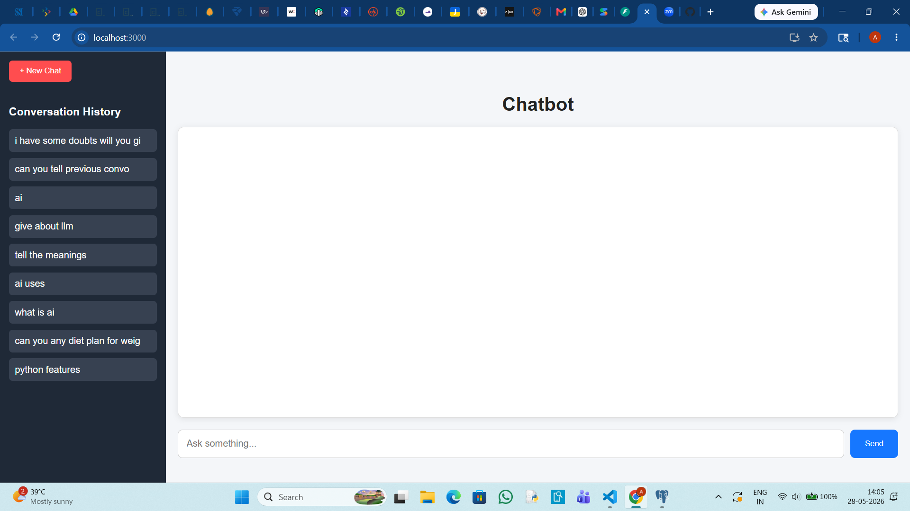
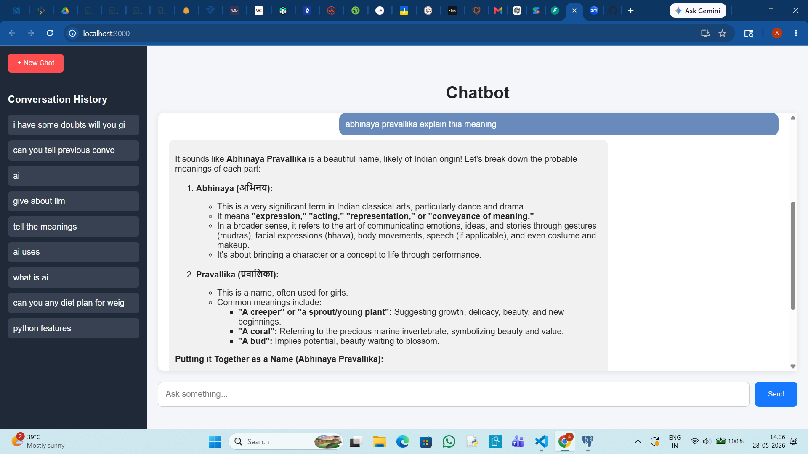

# LLM Observability Chatbot

A full-stack chatbot application built using FastAPI, React, PostgreSQL, and Gemini API with conversation history tracking and observability features.

## Features

- Chat with Gemini LLM
- Session-based conversations
- Conversation history sidebar
- Markdown response rendering
- FastAPI backend
- React frontend
- PostgreSQL database storage
- API request logging and observability

## Tech Stack

### Frontend
- React.js
- Axios
- React Markdown
- CSS

### Backend
- FastAPI
- SQLAlchemy
- PostgreSQL
- Python

### AI Model
- Google Gemini API

## Project Structure

```text
llm-observability-chatbot/
│
├── backend/
│   ├── main.py
│   ├── models.py
│   ├── database.py
│   ├── llm_wrapper.py
│   └── requirements.txt
│
├── frontend4/
│   ├── src/
│   ├── public/
│   └── package.json
│
└── Screenshots/
```

## Screenshots

### Homepage



### Conversation History



## Installation

### Backend

```bash
cd backend

python -m venv venv

venv\Scripts\activate

pip install -r requirements.txt

uvicorn main:app --reload
```

### Frontend

```bash
cd frontend4

npm install

npm start
```

## Author

**Ramena Abhinaya Pravallika**

- Full Stack Developer
- AI/ML Enthusiast
- Oracle Generative AI Certified Professional
